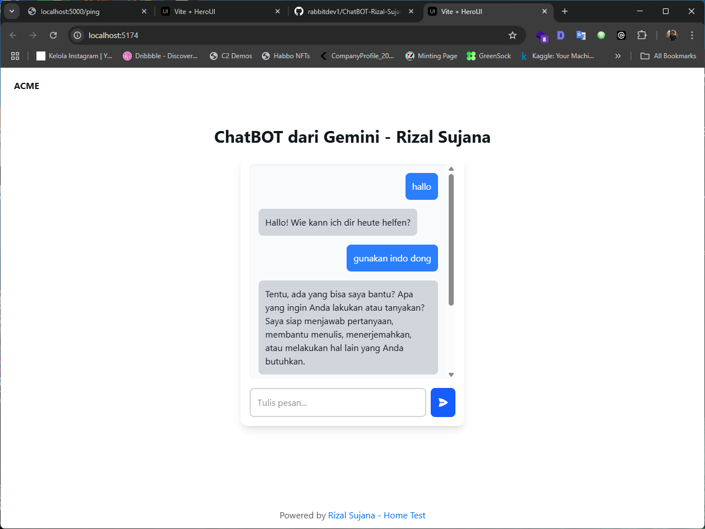

# Chatbot AI Gemini

A simple chatbot application built with React, Tailwind CSS, and integrated with Google's Gemini AI API to generate responses based on user input.

## Features
- **User Interaction**: Users can type messages, and the chatbot will respond with generated content using the Gemini AI API.
- **Tailwind CSS**: Styled with Tailwind CSS for a clean, responsive design.
- **Gemini AI Integration**: Utilizes the Gemini API from Google to generate meaningful chatbot responses.

## Technologies Used
- **React**: JavaScript library for building user interfaces.
- **Tailwind CSS**: Utility-first CSS framework for building custom designs.
- **Axios**: Promise-based HTTP client for making requests to the API.
- **React Icons**: Used for chat icons (such as the paper airplane icon).
- **Gemini AI**: AI model by Google to generate content based on user input.

## Screenshot

### Prerequisites

Before starting, ensure that you have the following installed:
- Node.js (v16 or higher)
- npm or yarn package manager
- A valid **Gemini API key** from Google Cloud

# Rizal Sujana - Developer Profile

Welcome to my profile! I am a passionate developer with expertise in various technologies. Below are my contact and social media links where you can connect with me and follow my work.

## Links:
- **LinkedIn**: [Rizal Sujana](https://www.linkedin.com/in/rizalsujana)
- **GitHub**: [Rizal Sujana GitHub](https://github.com/rabbitdev)
- **Instagram**: [@callucifrr](https://www.instagram.com/callucifrr)
